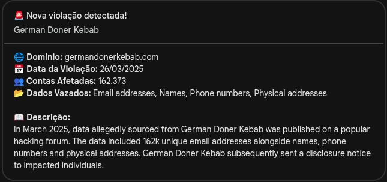

# Check de Vazamentos

Este projeto contém um script desenvolvido em Node.js para monitorar vazamentos de dados envolvendo empresas específicas. A verificação é realizada por meio da API pública do serviço [Have I Been Pwned](https://haveibeenpwned.com/).

## 1.0 Funcionamento

O ponto de entrada da aplicação é o arquivo `main.js`, que chama a função `checkVazamentos.js`, passando como argumento uma lista contendo os nomes das empresas a serem monitoradas.

Esses nomes estão definidos em um array dentro do arquivo `listaEmpresas.js`.

A cada execução, o script realiza uma consulta à API do HIBP (`https://haveibeenpwned.com/api/v3/latestbreach`) para obter o último vazamento registrado. Se o nome de alguma empresa da lista estiver contido nos dados do vazamento, uma verificação adicional será realizada para evitar notificações duplicadas.

## 1.1 Verificação no banco de dados

Cada vazamento retornado pela API do HIBP possui um identificador único, representado pelo campo **Name**. Antes de enviar qualquer notificação, o script consulta o banco de dados para verificar se o vazamento já foi registrado.

- Se o vazamento **já estiver salvo**, nenhuma ação será realizada.
- Se o vazamento **ainda não estiver salvo**, ele será inserido no banco de dados e uma notificação será enviada via Webhook.

## 1.2 Formato da notificação

As notificações são enviadas utilizando o formato "Card", compatível com plataformas como o Google Chat. A mensagem contém as seguintes informações:

- Nome da empresa
- Domínio afetado
- Data do vazamento
- Quantidade de contas impactadas
- Tipos de dados vazados
- Descrição do incidente



## 2.0 Exemplo de uso

Podemos pensar nos seguintes casos de uso:

> *"Tenho contas em sites como Oracle, Instagram e German Doner Kebab, e gostaria de ser notificado caso ocorra algum vazamento de dados relacionado a essas empresas."*

> *"Trabalho em uma empresa que possui contratos com outras organizações e quero monitorar possíveis vazamentos de dados dessas parceiras para agir rapidamente em caso de incidentes."*


Para isso, basta adicionar os nomes das empresas que deseja monitorar no array `listaEmpresas` que fica no arquivo [listaEmpresas.js](/src/listaEmpresas.js)

```javascript
const listaEmpresas = ["Oracle", "Instagram", "German Doner Kebab"];
```

Sempre que o script for executado:

- Verificar se há novos vazamentos relacionados às empresas da lista;

- Se um vazamento ainda não tiver sido registrado, ele será salvo no banco de dados e uma notificação será enviada;

- Se o vazamento já tiver sido identificado anteriormente, nenhuma ação será tomada.

### Exemplo prático

Como foi detectado um vazamento relacionado à empresa **German Doner Kebab**, uma **notificação será enviada via Webhook** contendo os detalhes do incidente.

Com essas informações em mãos, é possível tomar medidas preventivas como:

- Alterar **senhas de acesso** e **e-mails vinculados**;
- Revogar e gerar **novas chaves de API**;
- Realizar uma **análise de impacto mais profunda** para mitigar riscos.

## 3.0 Estrutura do Banco de Dados

O projeto utiliza um banco de dados PostgreSQL para registrar os vazamentos identificados e evitar notificações duplicadas.

A estrutura é criada automaticamente pelo script [`init.sql`](./postgres/init.sql), localizado na pasta `postgres`. Esse script:

1. Cria o banco de dados `monitoramento`;
2. Seleciona esse banco;
3. Cria a tabela `vazamentos` com os campos necessários para armazenar os dados da API.

### Tabela: `vazamentos`

| Coluna        | Tipo           | Descrição                                                             |
|---------------|----------------|----------------------------------------------------------------------|
| `id`          | SERIAL         | Identificador único (chave primária)                                 |
| `name`        | VARCHAR(255)   | Nome único do vazamento (campo `Name` da API HIBP)                   |
| `title`       | TEXT           | Título do vazamento                                                  |
| `domain`      | TEXT           | Domínio afetado pelo vazamento                                       |
| `breach_date` | DATE           | Data em que o vazamento ocorreu                                      |
| `added_date`  | TIMESTAMP      | Data em que o vazamento foi adicionado ao HIBP                       |
| `pwn_count`   | INTEGER        | Quantidade de contas impactadas                                      |
| `description` | TEXT           | Descrição do incidente                                               |
| `data_classes`| TEXT[]         | Tipos de dados comprometidos (ex: e-mails, senhas, CPF etc.)         |
| `notified`    | BOOLEAN        | Indica se a notificação já foi enviada (`true` ou `false`)           |
| `created_at`  | TIMESTAMP      | Data de inserção no banco (default: `CURRENT_TIMESTAMP`)             |

> Lembre-se de iniciar o banco e rodar esse script antes de executar o monitoramento.

## 4.0 Executando Localmente

Você pode rodar o projeto localmente em poucos passos usando **Node.js** e **Docker**. Basta seguir as instruções abaixo:

### Requisitos

- [Node.js](https://nodejs.org/) instalado (versão 18+ recomendada)  
- [Docker](https://www.docker.com/) instalado

## 4.1 Instalando as dependências

Clone o projeto e instale as dependências:

```
git clone https://github.com/guillhermef/breach_monitor.git
````

```
cd breach_monitor
```

```
npm install
```

## 4.2 Criando container do PostgreSQL

```
docker run --name postgres-vazamentos \
  -e POSTGRES_PASSWORD=12345 \
  -v $(pwd)/postgres/init.sql:/docker-entrypoint-initdb.d/init.sql \
  -p 5432:5432 \
  -d postgres:15
```

Esse comando irá criar o container do Postgres com o banco `monitoramento` e a tabela `vazamentos`.

## 4.3 Executando o Script

```
npm start
```

## 5.0 Conclusão

Após a execução dos testes você pode parar e remover o container do Postgres com os comandos:

```
docker stop postgres-vazamentos
docker rm postgres-vazamentos
```

## Dúvidas ou Sugestões?

Nos contate no [Linkedin](https://www.linkedin.com) para dúvidas e sugestões:

- [Guilherme Rodriges](https://www.linkedin.com/in/guilherme-rodrigues-30412a20a/)
- [Paulo Fabiano](https://www.linkedin.com/in/paulo-fabiano/)